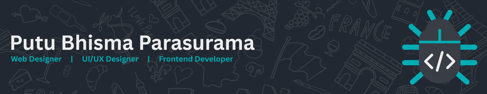

<!--
**bhismaparasurama/bhismaparasurama** is a ✨ _special_ ✨ repository because its `README.md` (this file) appears on your GitHub profile.

Here are some ideas to get you started:

- 🔭 I’m currently working on ...
- 🌱 I’m currently learning ...
- 👯 I’m looking to collaborate on ...
- 🤔 I’m looking for help with ...
- 💬 Ask me about ...
- 📫 How to reach me: ...
- 😄 Pronouns: ...
- ⚡ Fun fact: ...
-->

# About me
- 🧑‍💻 My name is Putu Bhisma Parasurama
- 🏫 I'm currently school in SMK Negeri 1 Mas Ubud
- 🍃 I'm currently learning Laravel, Tailwind CSS, and React JS
- 📍 Camenggaon Village  
- 🚀 Fullstack Developer 
- 🏸 Playing Badminton

# My Skills

# Media Socials

# Other
